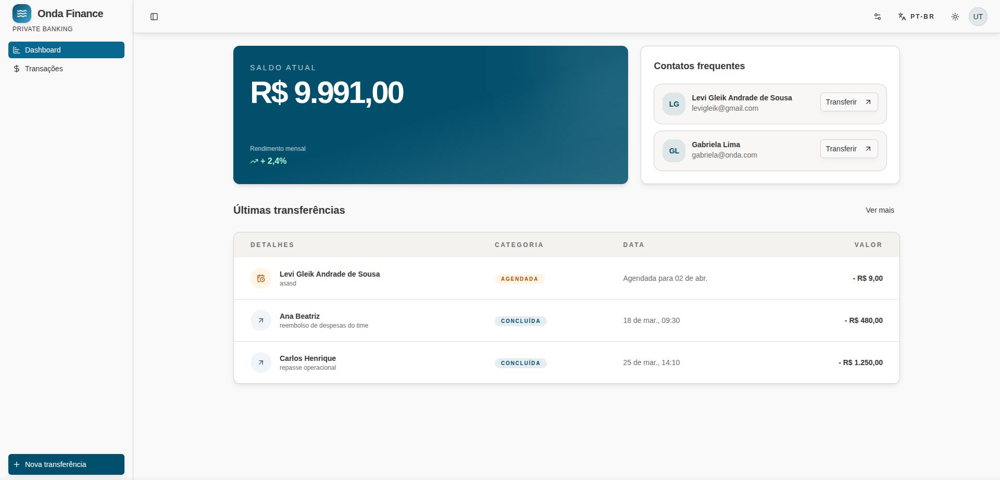

# Onda Finance

Aplicação web desenvolvida para o desafio Front-End da Onda Finance, simulando um app bancário com login mockado, dashboard, histórico de transferências, fluxo de transferência em 2 etapas e internacionalização.

## Deploy

https://ondafinance.netlify.app

## Preview

[](https://ondafinance.netlify.app)

## Stack

O projeto utiliza a stack obrigatória do desafio.

Ferramentas, bibliotecas e decisões complementares relevantes:

- `Docker` como stack complementar para build e execução isolada da aplicação
- `i18next` + `react-i18next` para i18n
- `react-router` em modo DATA para sincronizar idioma com a URL
- `Testing Library` para testes de comportamento da interface

## Como rodar o projeto

### Pré-requisitos

- Bun 1.3+ instalado
- Docker 24+ instalado (opcional)

### Instalação

```bash
bun install
```

### Desenvolvimento

```bash
bun dev
```

### Testes

```bash
bun run test
```

### Docker

```bash
docker build -t onda-fin .
docker run --rm -p 3000:3000 onda-fin
```

A aplicação ficará disponível em `http://localhost:3000`.

A imagem Docker usa build multi-stage com Bun, publica apenas o `dist/` e executa com usuário não root para reduzir a superfície de ataque.

## Login

O login da aplicação é mockado.

- Pode ser usado qualquer e-mail válido.
- A senha pode ser qualquer valor com 6 dígitos ou mais.
- Exemplo de acesso:
  - E-mail: `onda@finance.com`
  - Senha: `123456`

## Decisões técnicas adotadas

- O estado de autenticação, saldo e transferências foi mantido em Zustand com persistência local para simplificar o fluxo mockado do desafio.
- O formulário de transferência foi dividido em 2 etapas para reduzir carga cognitiva e facilitar as validações progressivas.
- As validações foram centralizadas com React Hook Form + Zod para manter regras explícitas e feedback consistente na UI.
- O i18n foi implementado com `i18next` + `react-i18next`, com `pt-BR` e `en-US`, usando lazy loading dos arquivos de tradução.
- O idioma passou a ser controlado pela rota pública `/:lang/...`, mantendo o router como fonte de verdade e sincronizando `i18n.changeLanguage(...)`.
- As formatações de moeda e data passaram a respeitar o idioma ativo da aplicação.
- Os status de transferência foram convertidos para códigos internos neutros, deixando a tradução apenas na camada de interface.
- Foi adicionado um seletor de idioma no navbar, preservando a rota atual ao trocar o locale.
- A cobertura de testes foi atualizada para incluir fluxo principal, redirecionamentos de idioma e compatibilidade com dados persistidos antigos.

## Extras implementados

- i18n com `pt-BR` e `en-US`, lazy loading por namespace e rotas localizadas em `/:lang/...`.
- Dark/light mode com persistência local e transição de troca de tema.
- Atalho de transferência direta a partir dos contatos frequentes calculados com base no histórico real de transferências.

## Segurança

O desafio pede apenas a explicação da estratégia, sem implementação obrigatória.

### Proteção contra engenharia reversa

- Nenhuma regra crítica de negócio, credencial ou segredo deve ficar embutido no front-end.
- Validações sensíveis, autorização e cálculos financeiros devem ser executados no backend.
- Em produção, a aplicação deve ser publicada com build minificada e sem exposição pública de segredos ou configurações internas.
- Integrações com APIs devem usar tokens e credenciais controlados no servidor, nunca no cliente.

### Proteção contra vazamento de dados

- Dados sensíveis não devem ser persistidos em `localStorage`; em cenário real, o ideal é usar sessão segura com backend.
- Todo tráfego deve ocorrer via HTTPS.
- O frontend deve receber apenas os dados estritamente necessários para cada tela.
- Logs e ferramentas de observabilidade devem mascarar informações pessoais e financeiras.
- Sessões devem ter expiração, revogação e logout seguro quando houver backend real.

## Melhorias futuras

- Integrar login, saldo e transferências com API real usando Axios + React Query.
- Adicionar cobertura para login, guards de rota e paginação com mais cenários de erro.
- Melhorar o code splitting do bundle principal além do lazy loading das traduções.
- Expandir os idiomas suportados além de `pt-BR` e `en-US`.
- Substituir persistência local por um modelo de autenticação seguro com backend.
